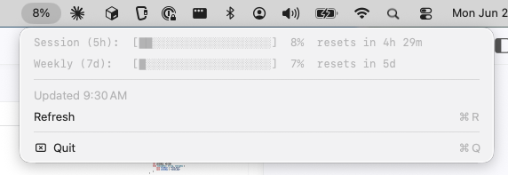

# claude-usage-bar
Claude Code current-session-usage in your MacOS status bar.

Shows a percentage value for your current session usage in the status bar. If you click on this, it shows progress bars and usage data for the current session and your weekly consumption, along with reset times.

